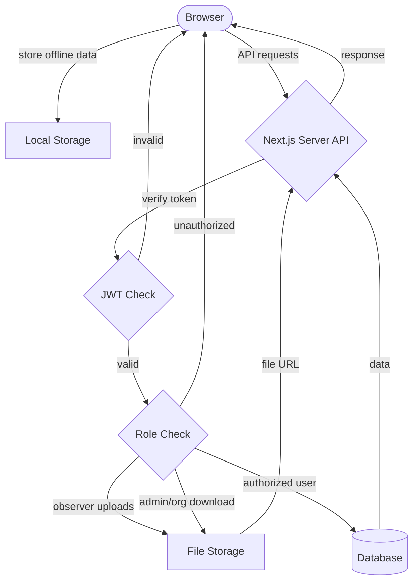
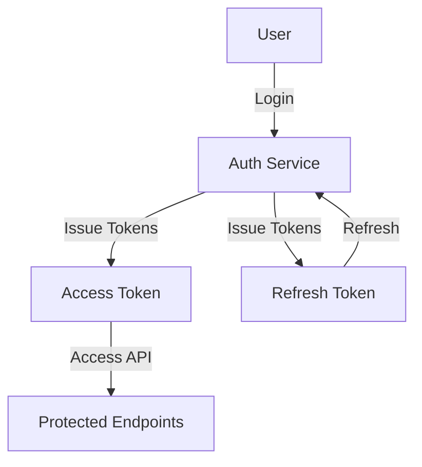
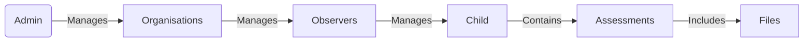
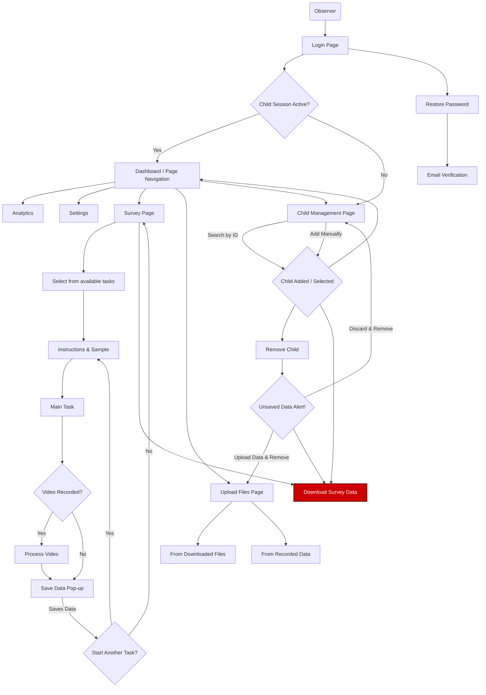
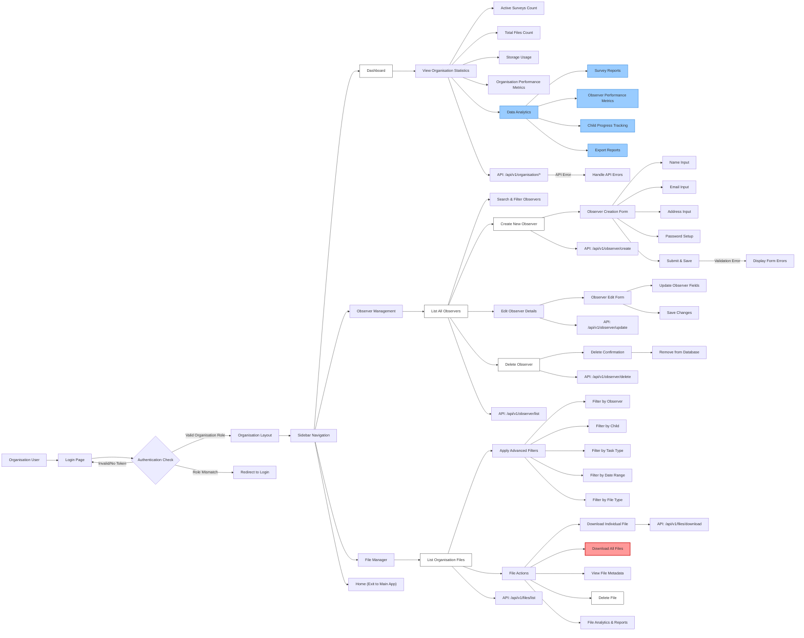
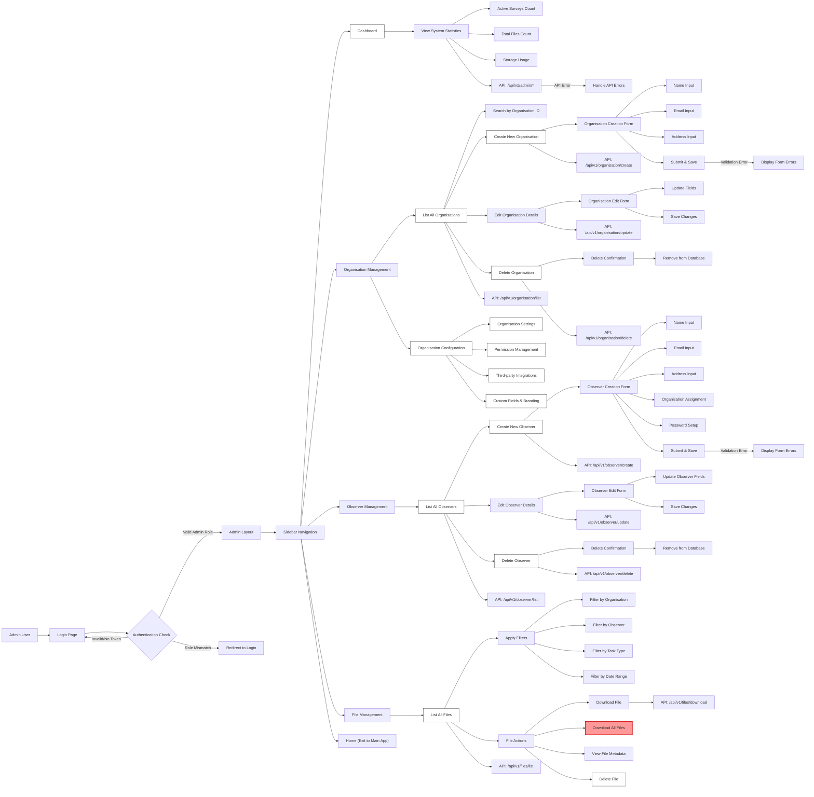

# START Project Scoping Document v3.0 (2025)

## 1. Overview

This document outlines the scope for an integrated platform focused on early ASD detection in children. The system is implemented as a modern web application with secure API services, supporting both clinical and research needs.

## 2. Aims

### 2.1. Assessment Platform

To provide a scalable, secure browser based platform that can be used for direct assessment to quantify ASD related dimension.

### 2.2. Secure Pipeline

To establish a secure pipeline for:

- Systematic data collection
- Clinical analysis
- Research insights
- Data protection and privacy

### 2.3. Solution Integration

- User-friendly for non-specialist health workers
- Deployable in naturalistic environments (home or routine health-care settings)
- Secure for sensitive medical data
- Compliant with healthcare standards
- Focused on usability, acceptability, and utility

## 3. Technical Requirements

### 3.1. Frontend Compatibility

- Modern browsers (Chrome, Firefox, Safari, Edge)
- Progressive Web App capabilities
- Responsive design for various devices
- Landscape orientation only
- Optimized for tablet and desktop views
- Offline-first architecture

### 3.2. API Requirements

- RESTful API design
- JWT-based authentication
- Role-based access control
- Rate limiting and security measures

### 3.3. Language Support

- API Documentation: English
- User Interface: Multi-language support
- Data Storage: Unicode compliant

### 3.4. Security Requirements

- End-to-end encryption for sensitive data
- Token-based authentication
- Role-based access control
- Audit logging

## 4. System Architecture

### 4.1. **Full-Stack Next.js Application**

- App Router for server/client components
- API Routes (/api/v1/\*)
  - Built-in API routing
  - Server-side endpoints
  - Middleware support
- Progressive Web App capabilities
- Responsive design system with Tailwind CSS
- Server Components for improved performance
- Client Components for interactive features

### 4.2. **Backend Services**

- Next.js API Routes for server-side logic
- MongoDB database for data persistence
- Amazon S3 for file storage
  - Secure file uploads
  - CDN distribution
  - Versioning support
- JWT-based authentication service
- Server-side rendering (SSR) capabilities

### 4.3. **Integration Layer**

- Next.js Edge Runtime
- Vercel deployment platform
- Token management with HTTP-only cookies
- Rate limiting on API routes
- Response caching strategies
  - Static page caching
  - Incremental Static Regeneration (ISR)
  - Dynamic API response caching

### 4.4. System Integration Flow



## Database Hierarchy

```

```

## 6. Role Hierarchy and Permissions

### 6.1. System Administrator (Admin)

- **Access Level**: Full system access
- **Capabilities**:
  - Organisation management
  - System configuration
  - User management
  - Data oversight
- **API Access**: All endpoints
- **Special Privileges**: Bypass authentication for emergency access

### 6.2. Organisation Manager (Organisation)

- **Access Level**: Organisation-wide access
- **Capabilities**:
  - Observer management
  - Data access within organisation
  - Report generation
  - File management
- **API Access**:
  ```
  ├── /organisation/*
  ├── /observer/*
  ├── /files/*
  └── /child/* (read-only)
  ```

### 6.3. Observer (Observer)

- **Access Level**: Assigned children only
- **Capabilities**:
  - Child profile management
  - Assessment data collection
  - File uploads
  - Personal profile management
- **API Access**:
  ```
  ├── /child/create
  ├── /child/list
  ├── /files/upload
  └── /files/list
  ```

### 6.4. Public Access

- **Access Level**: Public endpoints only
- **Capabilities**:
  - System health check
  - Documentation access
- **API Access**:
  ```
  └── /health
  ```

## 7. Data Flow and Access Control

### 7.1. Authentication Flow



### 7.2. Data Access Hierarchy



### 7.3. Permission Matrix

| Resource Type | Admin | Organisation | Observer | Public |
| ------------- | ----- | ------------ | -------- | ------ |
| System Config | ✓     | ✗            | ✗        | ✗      |
| Organisation  | ✓     | Read Only    | ✗        | ✗      |
| Observer      | ✓     | ✓            | Self     | ✗      |
| Child         | ✓     | ✓            | Assigned | ✗      |
| Files         | ✓     | Own Org      | Own      | ✗      |
| Health Check  | ✓     | ✓            | ✓        | ✓      |

### 7.4 Observer App Interaction Flow



### 7.5 Organisation App Interaction Flow


### 7.6 Admin App Interaction Flow



## 8. Security Measures

### 8.1. Authentication

- JWT-based token system
- Refresh token rotation
- Session management
- Brute force protection

### 8.2. Authorization

- Role-based access control
- Resource-level permissions
- Organization-based data isolation

### 8.3. **Data Protection**

- End-to-end encryption for sensitive data
- Secure file storage and serving:
  - HTTPS-only file access
  - Time-limited pre-signed URLs
  - Content-Security-Policy headers
  - Cross-Origin Resource Sharing (CORS) restrictions
  - SSL/TLS encryption for all file transfers
  - Request signing for S3 operations
- Audit logging:
  - File access tracking
  - Download/upload timestamps
  - User and role identification
- Data retention policies:
  - Automated file expiration
  - Versioning control
  - Backup management
